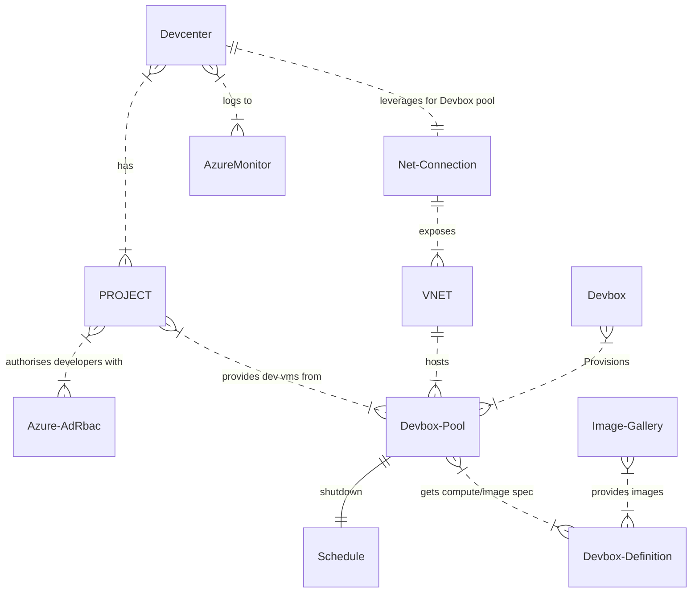
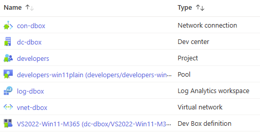
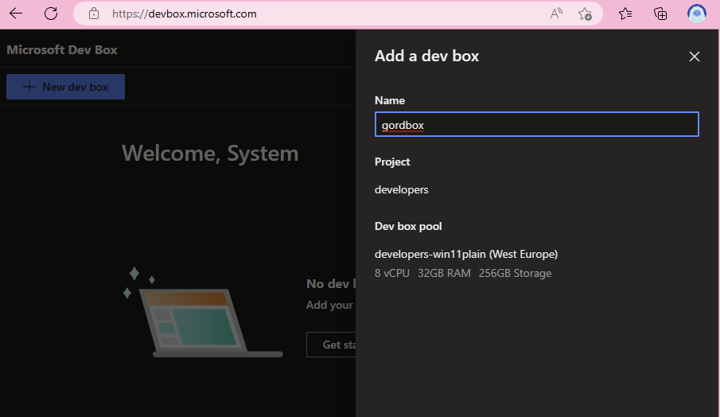

# Azure Devcenter Quickstart

This guide helps accelerate onboarding to the two Azure Services that Azure Devcenter enables by providing Bicep Infrastructure as Code to quickly deploy and configure the services.

1. [Azure Devbox](https://learn.microsoft.com/azure/dev-box/overview-what-is-microsoft-dev-box) - Give your developers access to managed Windows Virtual Machines to code on
1. [Azure Deployment Environments](https://azure.microsoft.com/products/deployment-environments) - Provide curated Azure infra templates to your developers to *deploy* their code into

## Devcenter concepts

### Projects

Both Devbox and Deployment Environments use several common Devcenter components to drive their experiences. Central to these is the concept of `Projects`. A project is what binds the developer access to developer workstations through Devbox and the relevant templates from ADE.

### Azure Services

A typical Devcenter configuration depends on & integrates a lot of Azure Services. This can be a little confusing, but also takes time to correctly configure a working environment. The IaC in this repository provides the consistency of creation and configuration of all these components via 2-3 az cli commands.



## Prerequisites

Devbox has several license [prerequisites](https://learn.microsoft.com/azure/dev-box/quickstart-configure-dev-box-service?tabs=AzureADJoin#prerequisites). Namely Windows, Intune and AzureAD.

Your Azure AD tenant must be enabled for [auto-enrolment](https://learn.microsoft.com/mem/intune/enrollment/quickstart-setup-auto-enrollment) of new devices (intune).

It doesn't work with invited (B2B) identities, so users will need to be directly associated with the tenant.

To complete the steps in this guide, you will need the Azure CLI and the GitHub CLI.

## Deploy the common infrastructure

```bash
az deployment group create -g innerloop -f bicep/common.bicep -p devboxProjectUser=$(az ad signed-in-user show --query id -o tsv)
```

## Azure Devbox

A fully working Devbox requires a lot of connected components. The bicep IaC included in this repository will help expedite the creation of a functioning Devbox.

```bash
 az deployment group create -g innerloop -f bicep/devbox.bicep -p devcenterName=dc-dbox
```

### Deployed Resources



### Access the Devbox

Your Developers will access Devbox resources through a dedicated portal; [https://aka.ms/devbox-portal](https://devbox.microsoft.com/)



## Azure Deployment Environments

`ADE section status : wip`

### Catalog repo

ADE requires a catalog in the form of a Git repository. The catalog contains IaC templates used to create environments.
To quickly get started with a sample catalog, use these commands to fork the [ADE](https://github.com/Azure/deployment-environments) repo.

```bash
gh repo fork Azure/deployment-environments
```

> After creation of the repository, [create a PAT token](https://learn.microsoft.com/azure/deployment-environments/how-to-configure-catalog#create-a-personal-access-token-in-github) to allow ADE to gain access to these resources.

### ADE Infrastructure

Lets create the infrastructure components for ADE

```bash
PAT="paste-your-pat-token-here"
az deployment group create -g innerloop -f bicep/ade.bicep -p devcenterName=dc-dbox
```

### Assign Access

The Devcenter uses a new managed identity to create Azure resources.
For any subscriptions/resource groups that are to be used for ADE deployments RBAC assignments must be made.

```bash
CURRENTSUBID=$(az account show --query id -o tsv)
DEPLOYSUBID=$CURRENTSUBID
DEPLOYRG=deployrg

#create rbac


```

### Deploy an environment

